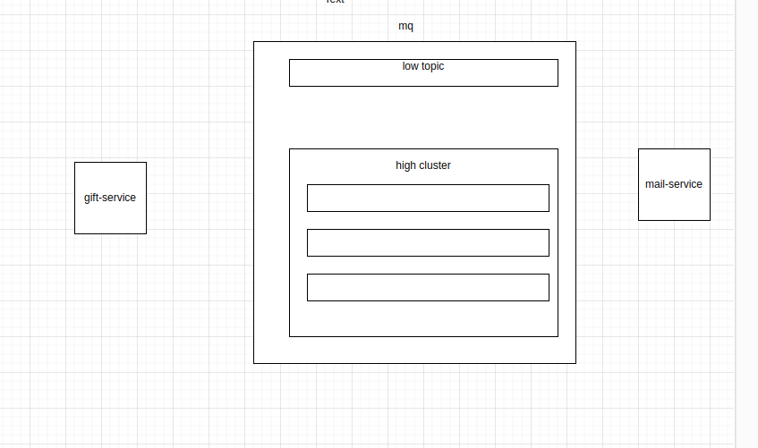

- Mô hình của cho bài test gồm 2 service chính

- Service gift sẽ dùng để lấy user từ db lên, tính toán quà, thứ hạng
- Service mail sẽ nhận message và chuyên để gửi mail
- Theo ảnh thì sẽ dùng 1 MQ như Kafka để thực hiện chia việc gửi mail số lượng lớn trên nhiều topic, partition khác nhau
- Về topic của kafka sẽ chia thành 2 phần: 
  - Phần 1 là 1 topic riêng gọi low topic để thực hiện số lượng ít message như gửi
  mail cho top1-10, top 11-20, retry...
  - Phần 2 là 1 cụm các topic(đang chia thành 4 topic) sẽ thực hiện gửi xử lí message cho top 100 trở đi(Phần này tùy vào
  nhu cầu, số message có thể chia thành nhiều topic hơn)